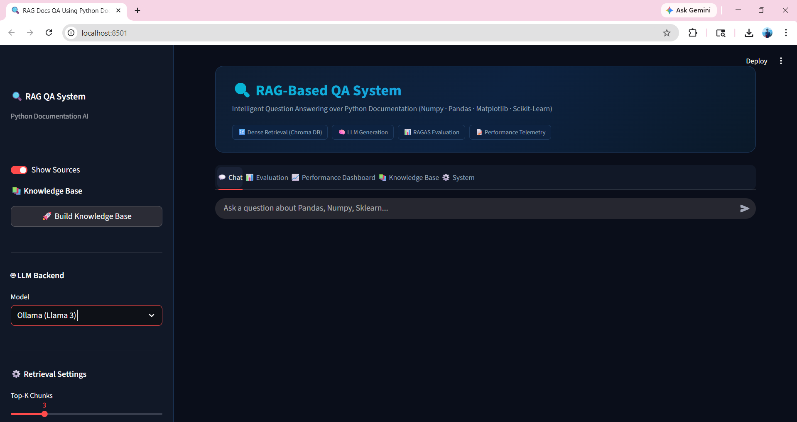
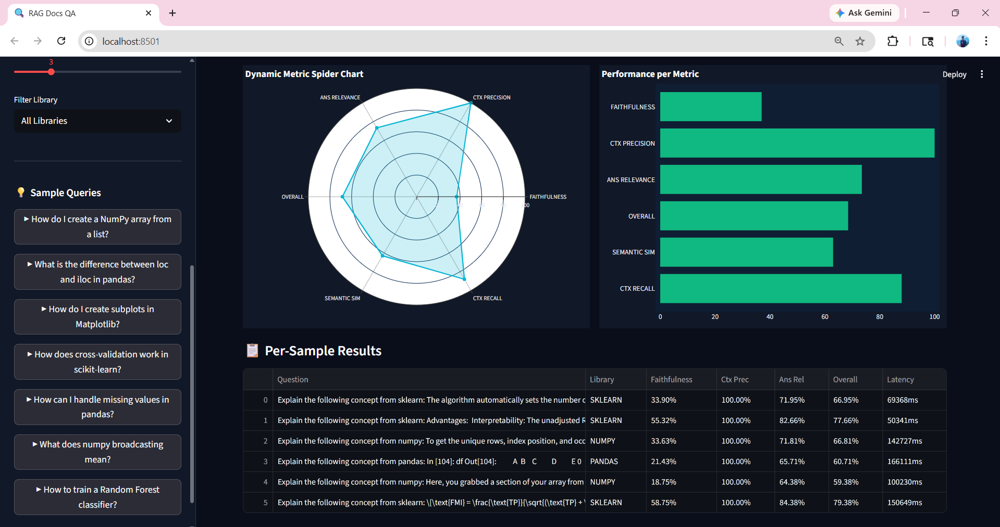
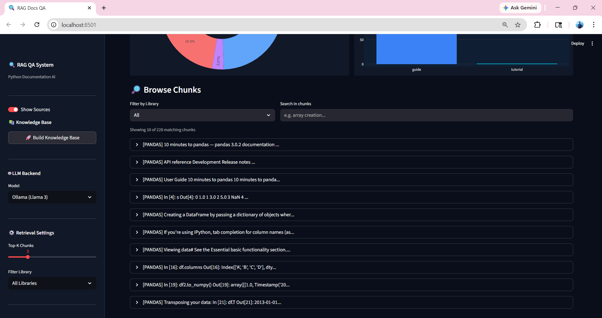

# 🔍 RAG-Based QA System — Python Documentation Assistant

A production-style **Retrieval-Augmented Generation (RAG)** application that answers natural-language
questions over NumPy, Pandas, Matplotlib, and Scikit-Learn documentation — with a live evaluation suite,
a performance telemetry dashboard, and a searchable knowledge-base explorer.

**🔗 Live demo:** _add your Streamlit Cloud URL here after deploying_



---

## ✨ Highlights

- **Retrieval-Augmented Generation pipeline** — dense retrieval over a persisted ChromaDB vector store,
  grounded generation with a strict no-hallucination prompt, and library-level metadata filtering.
- **Live evaluation suite** — dynamically samples real chunks from the vector store, generates test
  questions, and scores faithfulness, context precision, and answer relevance.
- **Performance telemetry dashboard** — per-query latency (retrieval vs. generation), token usage,
  confidence scores, and a retrieval-accuracy confusion matrix, all computed from real usage.
- **Knowledge base explorer** — browse and search every chunk in the vector store, with distribution
  charts by library and document type.
- **Pluggable LLM backend** — runs on free, hosted **Groq** (Llama 3) out of the box, with drop-in support
  for OpenAI or a local Ollama model.

## 🏗️ Architecture

```
                 ┌─────────────────┐
  User Question ─▶   Streamlit UI  │
                 └────────┬────────┘
                          ▼
                ┌───────────────────┐
                │  Dense Retriever   │  all-MiniLM-L6-v2 embeddings
                │  (ChromaDB, top-k) │  + library metadata filter
                └─────────┬──────────┘
                          ▼
                ┌───────────────────┐
                │  Grounded Prompt   │  context + question,
                │   Construction     │  "don't hallucinate" guardrail
                └─────────┬──────────┘
                          ▼
                ┌───────────────────┐
                │   LLM Generation   │  Groq / OpenAI / Ollama
                └─────────┬──────────┘
                          ▼
                ┌───────────────────┐
                │  Answer + Sources  │  + latency & token telemetry
                └───────────────────┘
```

## 🧰 Tech Stack

| Layer | Technology |
|---|---|
| UI | Streamlit |
| Orchestration | LangChain |
| Vector Store | ChromaDB (persisted) |
| Embeddings | `sentence-transformers/all-MiniLM-L6-v2` (local, CPU) |
| LLM | Groq (Llama 3, free) / OpenAI / Ollama |
| Evaluation | Custom faithfulness & context-precision scoring |
| Visualization | Plotly, Matplotlib, Seaborn |

## 📸 Screenshots

| Chat + Retrieved Sources | Evaluation Dashboard |
|---|---|
|  |  |

| Performance Telemetry |
|---|
|  |

---

## 🚀 Run Locally

```bash
# 1. Clone and install
git clone <your-repo-url>
cd rag_project
pip install -r requirements.txt

# 2. Get a free Groq API key
# https://console.groq.com/keys

# 3. Launch
streamlit run app.py
```

Paste your Groq API key into the sidebar (or save it to `.streamlit/secrets.toml`, see
`.streamlit/secrets.toml.example`). A knowledge base is already bundled in `vectorstore/`, so the app
works immediately — click **"Build Knowledge Base"** in the sidebar only if you want to re-scrape and
rebuild it from scratch.

## ☁️ Deploy for Free (Streamlit Community Cloud)

1. Push this repo to GitHub (public).
2. Go to [share.streamlit.io](https://share.streamlit.io) → **New app** → select the repo, branch, and
   `app.py` as the entry point.
3. Under **Advanced settings → Secrets**, add:
   ```toml
   GROQ_API_KEY = "your-key-here"
   ```
4. Click **Deploy**. You'll get a public URL to put on your resume/portfolio.

## 📂 Project Structure

```
rag_project/
├── app.py                 # Streamlit UI & orchestration
├── requirements.txt
├── runtime.txt             # Pins Python version for cloud deploys
├── data/
│   └── raw_docs.json       # Scraped documentation metadata
├── vectorstore/
│   └── chroma_db/          # Pre-built, persisted vector store (ships with the repo)
└── src/
    ├── data_loader.py      # Multi-library documentation scraper
    ├── chunking.py         # Recursive text splitting
    ├── embeddings.py       # Local embedding model loader
    ├── vector_db.py        # ChromaDB build/load
    ├── retriever.py        # Retriever construction
    ├── prompt_engineering.py  # Grounded RAG prompt template
    ├── llm.py               # Pluggable LLM backend (Groq / OpenAI / Ollama)
    └── evaluation.py        # Dynamic test-set generation & scoring
```

## 🗺️ Roadmap

- [ ] Swap MiniLM for a larger embedding model behind a toggle
- [ ] Add conversation-aware (multi-turn) retrieval
- [ ] Persist evaluation history across sessions

---

Built as a portfolio project to demonstrate an end-to-end RAG pipeline: retrieval, grounded generation,
evaluation, and observability — not just a chatbot demo.
